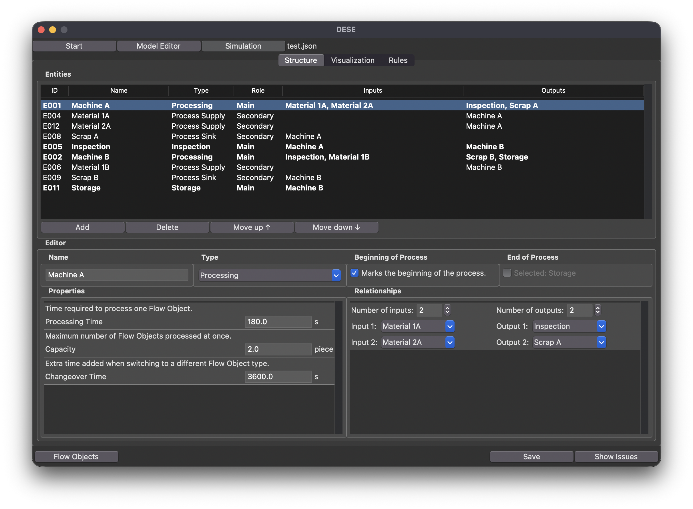
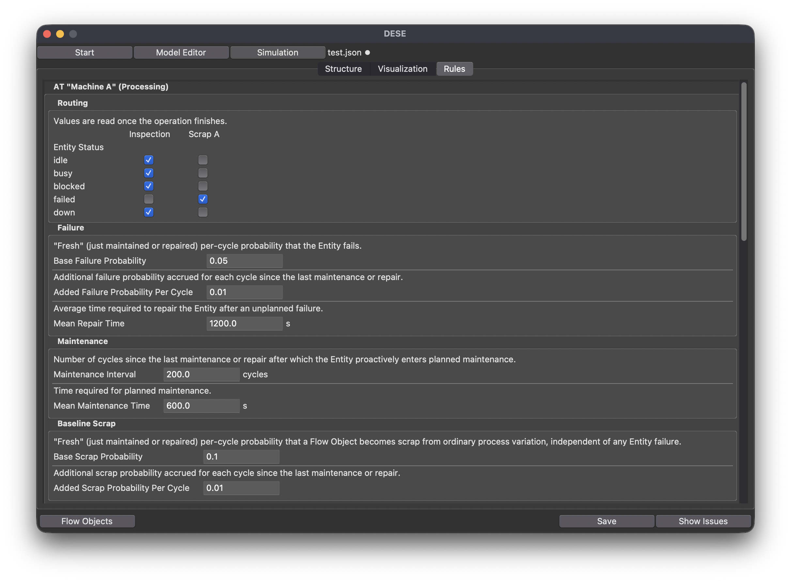
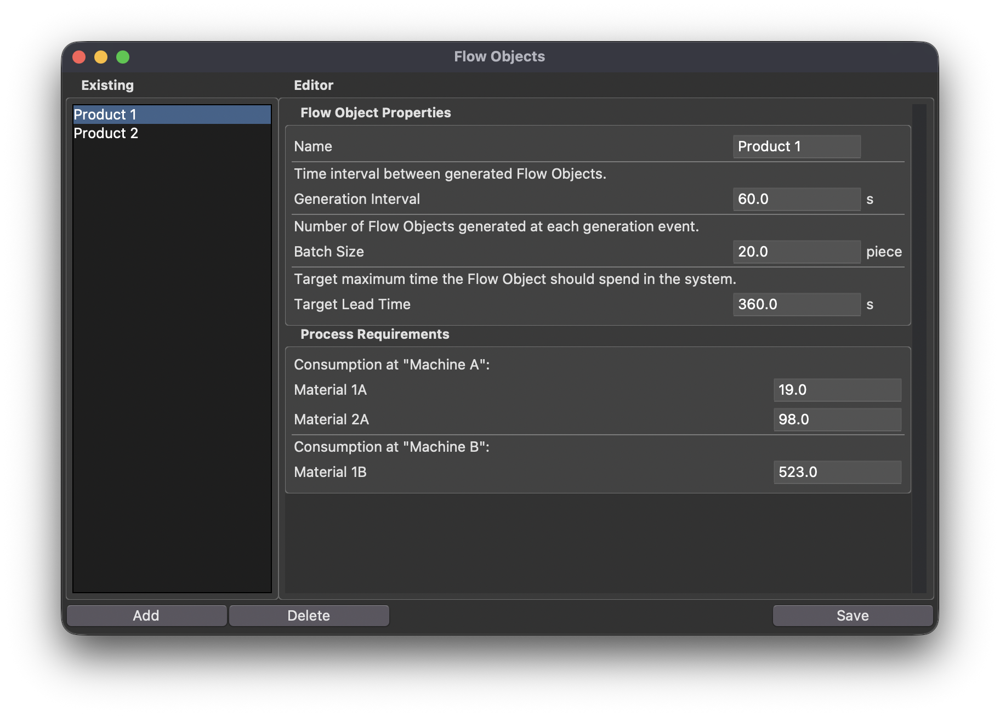
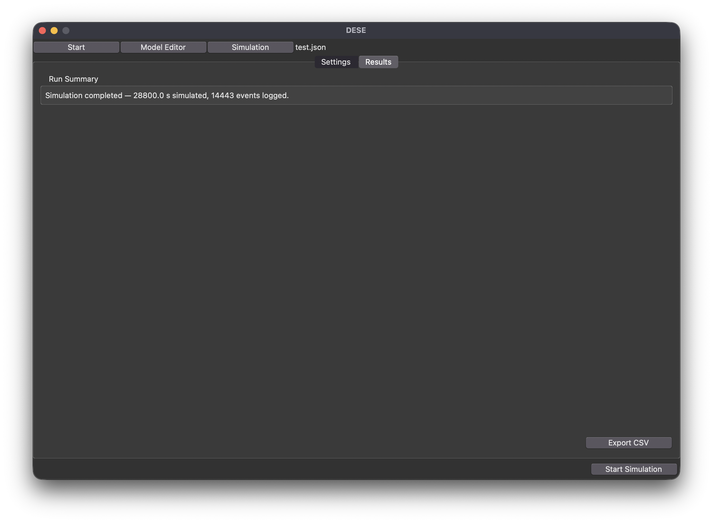

# DESE - Discrete Event Simulation Engine

📖 [Documentation](https://matesarandi.github.io/dese/)

A schema-driven discrete-event simulation tool with a Tkinter GUI: build a
process model (entities, relationships, routing rules), run a simulation
against it, and export the resulting event log as CSV.

This is a **beginner portfolio project**, built AI-assisted with Claude Code.
It is as much a way to consolidate and keep what I've learned from books and
tools in one real, working thing, as it is a demo piece. See
[AI assistance](#ai-assistance) below for exactly what that means here.

## What it does

- A schema-driven **Model Editor**: define entities (Processing, Storage,
  Process Supply, Sink...), their relationships, routing rules, and Flow
  Object types, all validated against a JSON schema (`schemas/schema.json`).
- A **Simulation Engine**: a discrete-event loop that runs the model,
  including processing cycles, quality-based routing, maintenance/failure/
  wear modeling, multi-input merge fairness, and Process Supply consumption.
- **CSV export** of the full event log, meant to be analyzed outside the app
  (the app itself only shows a minimal run summary).

## Screenshots

**Model Editor — Structure tab**: entities and their relationships.


**Model Editor — Rules tab**: routing, failure, and maintenance rules.


**Flow Objects**: Flow Object types and their process requirements.


**Simulation — Results tab**: a completed run's summary and CSV export.


## AI assistance

The simulation core, meaning the event loop, routing, and retry/fairness
logic under `src/dese/engine/`, is **AI-generated logic** (Claude Code),
closer to a simplified SimPy-style engine than a hand-designed algorithm.

My own contribution was directing the collaboration: designing the
schema-driven GUI and data model, structuring the project, and the iterative
debugging that came with it (more on that under [Testing](#testing)).

## Project origin

I wanted to generate my own data so I could keep learning data analysis in
Python, and eventually take it further into more serious territory. I had in
mind quantitative methods for decision-making, mathematical and optimization
modeling, probability, proper discrete-event simulation tooling, and machine
learning. The first plan was sketched out in a word processor. From there,
looking into the most actively researched areas in the field pointed me
toward digital twins and decision support. This became a digital-twin builder
with a (currently minimal) decision-support layer on top. That felt closer to
a real industry problem than another isolated exercise with no real context
or use beyond the exercise itself.

The first ~2600 lines were written by hand in VS Code, with minimal
assistance from ChatGPT, to push past smaller Python automation tasks into
more serious programming. Once that part was done, I started tracking it in
Git/GitHub and organized the backlog in Jira. I then brought in Claude Code to
audit the code, clean it up, and continue developing collaboratively, and I
asked it to explain the weak spots the audit found. Sphinx then turned the
resulting docstrings into the documentation linked above, which GitHub
Actions publishes automatically on every push. Getting properly used to this
whole toolchain was as much the point of this project as writing the code itself.

## Project structure

```
dese/
  assets/screenshots/ # README screenshots
  src/dese/           # the package (src layout)
    core/             # model/schema/validation logic
    engine/           # the discrete-event simulation core
    application/      # the Tkinter GUI
    schemas/          # schema.json
    templates/        # empty_model.json
  docs/               # Sphinx documentation source (see docs link above)
  .github/workflows/  # CI: auto-builds & publishes docs on push to main
```

## Getting started

Requires Python 3.9 or newer. There are no third-party runtime dependencies.
Everything the app uses is in the Python standard library, including
`tkinter`, which ships with most Python installs.

```bash
git clone https://github.com/matesarandi/dese.git
cd dese/src
python3 -m dese.application.gui
```

## Testing

There's no automated test suite. What testing has actually happened so far:

- Hand-built models exercising every routing/maintenance/quality feature,
  run end-to-end through the real GUI.
- With AI assistance, identifying typical and extreme model configurations
  with an unambiguous expected outcome, then comparing that expected outcome
  against the actual results in the exported CSV.

## Lessons learned

- **Prefer established libraries over hand-rolled infrastructure.** This
  project's hand-rolled discrete-event engine ran into bugs that a mature
  library like SimPy, with its own `Resource`/`PriorityResource` primitives,
  would have avoided by design. Building that logic from scratch meant
  solving a problem that was already solved elsewhere. Next time, use the
  existing tool instead of reinventing it.
- **Keep the design flexible on purpose.** The GUI was deliberately designed
  to only fill and display JSON against a schema, anticipating that new
  variables would keep turning out to be missing along the way. That
  decision paid off: adding a missing variable later was just a data change,
  not a redesign.
- **AI assistance needs active steering.** It tends to anchor hard on
  whatever was said last. For example, one offhand comment about needing
  something by tomorrow made it start treating everything as due tomorrow.
  Noticing when it's actually uncertain, rather than confidently wrong, is
  its own skill to build.

## Development opportunities

- **Decision support and AI/ML layer.** Solver/optimization integration,
  machine learning and prediction, a feedback loop between the simulation and
  AI, and reinforcement learning. This is the part the current engine only
  hints at.
- **Deeper simulation modeling.** Conveyor capacity and congestion,
  control-strategy-based flow handling, event replay, a cost model, loss and
  bottleneck detection, and risk and stress-test scenario analysis.
- **Process visualization.** A visual diagram of the model, showing entities
  and relationships as an actual flowchart instead of the current
  table-based editor, would make the process structure much easier to read
  at a glance.
- **UI/UX polish.** Selectable themes, a proper dashboard and export view,
  and general layout polish.
